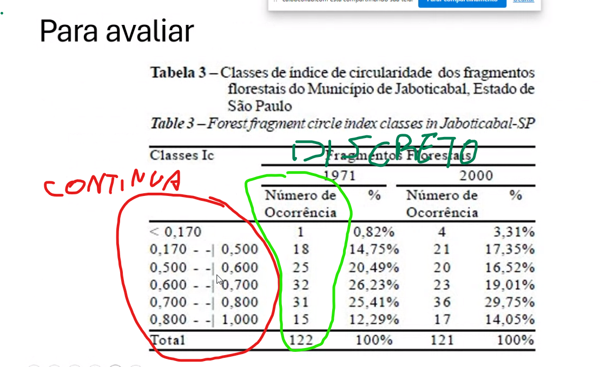

# Variavel Aleatoria
    - Caracteristicas da Discreta e Continua
    - Experiencia aleatoria
    
# Variavel Discreta
    - Sem uma ordem inerente
    Exemplo:
        - Número de erros de impressão em um livro(numeros fixos)

# Variavel Continua
    - Dentro do intervalo especificado
    Exemplo:
        - Idade de uma pessoa

